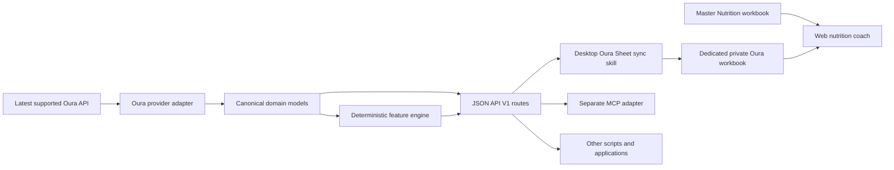

# Architecture

Target project contract: Oura Data API V1
Provider reference: latest supported Oura API, verified against Oura OpenAPI
revision 1.35 on July 12, 2026.

## Version boundary

`V1` refers to this project's public API contract. Oura's own provider API has
an independent version and currently exposes `/v2/usercollection` routes. The
provider version is isolated behind one adapter so upstream upgrades do not
force a project API major-version change.

## Target system

The API repository contains no Google Sheets or MCP dependency in steady state.
The Sheet sync skill and future MCP server are clients of the API.

## Layers

### HTTP boundary

FastAPI routes validate public V1 requests and serialize public V1 responses.
Routes do not call `httpx`, read provider dictionaries, calculate Sheet rows,
or contain nutrition logic.

### Application services

Application queries coordinate bounded resource retrieval, per-resource
capability states, composite days, and deterministic analytics. They return
canonical models or public projections.

### Canonical domain

Strict models preserve source identity, Oura canonical `day`, timestamp offsets,
nulls, explicit zeroes, and raw units. One coverage evaluator owns the
`available`, `empty`, `not_granted`, `disabled`, and `error` vocabulary.

### Deterministic feature engine

Pure functions calculate consumer features such as numeric/display sleep,
stress/recovery hours, workout minutes, contributor attention, past-only
28-day medians/deltas/sample counts, and coverage-aware weekly summaries. They
never produce AI prose, diagnoses, calorie prescriptions, or hidden composite
scores.

### Oura provider adapter

One typed registry describes provider paths, stable/experimental state, date or
datetime filters, capability expectations, paging, and mapper selection. Typed
provider DTOs tolerate unknown new fields; strict canonical models prevent
unreviewed provider fields from silently entering V1.

The adapter owns:

- OAuth token refresh and rotation;
- HTTPS enforcement and `trust_env=False`;
- bounded timeouts, retries, and provider rate-limit handling;
- `data`/`next_token` pagination-loop protection;
- source-ID deduplication;
- sanitized provider errors.

### Read-through cache

V1 uses a cache interface with a short-lived in-memory implementation by
default. It is an optimization, not the source of truth. Responses disclose
freshness. Persistent health-data caching is opt-in future work with a separate
privacy review.

## Oura provider findings

- OAuth authorization code flow is required for current applications.
- Personal access tokens are no longer the supported public setup path.
- Collection responses use `data` and an opaque `next_token`.
- Date-keyed collections generally accept `start_date`/`end_date`; heart-rate
  and ring-battery time series use datetime bounds.
- Source timestamps are ISO 8601. Oura `day` remains the canonical calendar key.
- Durations are seconds unless the resource documents another unit.
- Missing/null gaps are valid when the ring was not worn or not synchronized.
- Detailed `sleep` can contain multiple records for one day, including naps.
- `daily_sleep` is the daily score/contributor summary, not the detailed sleep
  period.
- `daily_stress` provides daily high-stress and high-recovery durations, not a
  continuous public stress time series.
- The public workout schema does not promise workout heart-rate samples.
- Legacy `tag` is deprecated in favor of `enhanced_tag`.
- Resilience behavior/scopes vary by account and remain capability-gated.
- Interbeat intervals are not in the linked official OpenAPI revision and are
  experimental until officially documented.

Official references:

- [Oura API documentation](https://cloud.ouraring.com/v2/docs)
- [Oura OpenAPI 1.35](https://cloud.ouraring.com/v2/static/json/openapi-1.35.json)
- [Oura authentication](https://cloud.ouraring.com/docs/authentication)
- [Oura error handling](https://cloud.ouraring.com/docs/error-handling)

## Configuration and security

- Runtime settings come from one explicit `.env` file. Windows, shell, and
  parent-process environment variables are ignored.
- The core/app factory receives a typed Settings object, keeping tests and
  library reuse independent of ambient process state.
- Oura credentials and tokens never cross the API boundary.
- The gateway bearer token is separate from Oura OAuth credentials.
- Default binding is `127.0.0.1`; CORS is disabled and telemetry is off.
- Non-loopback deployment requires explicit opt-in and HTTPS at the deployment
  boundary.
- Logs and problem responses contain correlation IDs, never secrets, raw
  authorization responses, provider bodies, or stack traces.

## External consumers

### Google Sheets

The desktop `oura-sync` skill calls deterministic API endpoints and writes only
the separate private workbook defined by
[the Sheet contract](<08 - Dedicated Oura Workbook Contract.md>).
It hard-denies the Master Nutrition workbook ID and performs exact readback
validation before advancing sync state.

### MCP

MCP is developed in a separate project after API V1 stabilizes. Its tools map
to API routes and contain no Oura OAuth, provider mapping, analytics, or Google
logic.

### Web nutrition coach

The web skill cannot depend on localhost or desktop MCP. It reads the Master
Nutrition workbook and dedicated Oura workbook independently, joins exact dates
in memory, and treats Oura as optional supporting evidence. See the
[web consumer handoff](<09 - Web Consumer Handoff.md>).

## Reliability invariants

- Explicit bounded ranges and opaque cursors.
- Current day is Provisional and is not treated as finalized.
- Missing is never zero and missing dates are never fabricated.
- Supplemental failure cannot erase usable core data.
- Successful-empty and failed/disabled/not-granted are distinct outcomes.
- Historical corrections refresh dependent 28-day baseline windows and
  affected weeks.
- Active/workout calories remain context only.
- Every Sheet write is idempotent and read back before state advances.

## Migration status

Commit `6db36ba` is the validated pre-API structure checkpoint. The runtime on
that commit is still the legacy MCP server. The staged work and exit gates are
tracked in [the implementation plan](<11 - Implementation Plan.md>);
documentation may
describe the approved target before the runtime cutover is complete.
