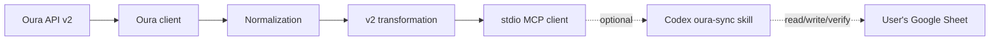

# Architecture

Last verified against Oura API v2 and OpenAPI revision 1.35 on July 11, 2026.

## Boundaries

Oura MCP Gateway is deliberately a thin, local stdio server:

- it authenticates one user's Oura application;
- retrieves Oura API v2 collections;
- normalizes source records;
- computes a versioned analysis-ready transformation; and
- returns data to the requesting MCP client.

It does not host OAuth for other users, authenticate to Google, write a spreadsheet, prescribe nutrition, or treat
wearable calories as a nutrition target.

Keeping Google mutation outside the server makes Oura retrieval testable, keeps OAuth scope narrow, and lets each
destination own its own write/readback contract.

## Official API findings

- Oura API v2 is the supported integration surface.
- Authorization uses an OAuth application and authorization-code flow.
- The official authorization and token endpoints are
  `https://cloud.ouraring.com/oauth/authorize` and `https://api.ouraring.com/oauth/token`.
- Refresh tokens rotate. The gateway uses each response's `expires_in` instead of assuming a fixed lifetime.
- Collection responses use `data` plus an opaque `next_token`.
- Oura publishes a ceiling of 5,000 requests per five minutes per token and application.
- Oura's returned `day` is the canonical calendar key. Activity days begin at 04:00 local.
- Timestamps can contain offsets, but the API does not return an IANA timezone.
- The public schema does not provide a universal final flag, date-range limit, historical-retention guarantee, or
  immutability SLA.

Official references:

- [Oura API v2](https://cloud.ouraring.com/v2/docs)
- [Oura OpenAPI 1.35](https://cloud.ouraring.com/v2/static/json/openapi-1.35.json)
- [Oura authentication](https://cloud.ouraring.com/docs/authentication)
- [Oura errors and rate limits](https://cloud.ouraring.com/docs/error-handling)
- [Model Context Protocol](https://modelcontextprotocol.io/)
- [Python MCP server guide](https://py.sdk.modelcontextprotocol.io/server/)

## Date and missing-data model

Daily attribution always uses Oura's canonical `day`; it is never derived from UTC. Source-local offsets are preserved
without pretending they always equal `OURA_HOME_TIMEZONE`.

Missing values remain null. A zero appears only when the source explicitly returns zero or a child endpoint
successfully returns no records. A finalized no-core date is stored in audit state rather than emitted as an empty
analytical row.

Because Oura has no final/provisional flag, the current Oura day is integration-owned `Provisional`.

## Synchronization planning

With no explicit range or existing coverage, the latest 30 days are requested. Incremental planning includes:

- dates newer than the last verified date;
- retryable or unresolved failures; and
- a short recent overlap to refresh records that may have changed.

It does not assume that every absent historical curated row is a gap, because absence can mean confirmed no data.
Explicit backfills scan every bounded date. Each response limits requested dates and returns a continuation cursor.

## Reconciliation

Pure Sheet helpers upsert daily rows by date, children by Oura source ID, and audit/provenance by sync-run ID plus date.
Successfully retrieved date partitions are authoritative and can remove stale provisional or child rows. A failed
section preserves only its own previous fields.

The optional desktop skill writes, rereads, validates, and only then commits hidden scan state. The MCP server itself
does none of those mutations.

## Reliability

- explicit per-request and whole-operation timeouts;
- bounded exponential backoff;
- `Retry-After`, then rate-limit reset handling;
- pagination-loop protection and source-ID deduplication;
- bounded date chunks;
- one serialized refresh after a 401; and
- isolated per-section 403 failures so optional endpoints do not erase core data.

Raw upstream bodies, tokens, secrets, and stack traces are never returned through MCP.
